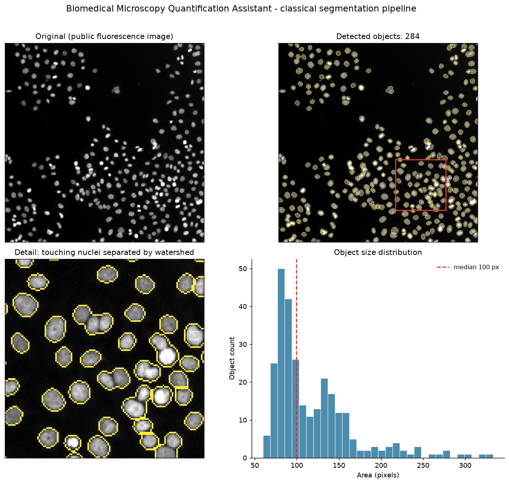

# Biomedical Microscopy Quantification Assistant

A proof-of-concept research software application that transforms microscopy
images into object-level quantitative measurements.



## Current capabilities

- Fluorescence-channel selection (grayscale, red, green, blue)
- Two segmentation engines: a classical watershed, and an optional pretrained
  model (Cellpose) that is markedly more accurate on touching nuclei
- **Percent-marker-positive quantification** from a two-channel image, which is
  the shape of a TUNEL, cleaved-caspase-3 or Ki67 readout
- Cell/nucleus segmentation by classical image processing
- Separation of touching objects using a distance-transform watershed
- Optional correction of uneven illumination before thresholding
- Cell counting
- Area, shape, and intensity measurements per object
- Multi-page TIFF and z-stack input, flattened by maximum intensity projection
- Batch analysis of many images into a single CSV
- CSV and annotated-image export

## Important limitation

This application is a technical demonstration and has not been validated for
research, diagnostic, or clinical use. It performs **classical image
processing**, not machine learning, and it makes no biological or clinical
interpretation of what it measures.

It *has* been scored against a public expert-annotated dataset (see
[Validation](#validation)): F1 = 0.899 at IoU 0.50 on 5,720 hand-annotated
nuclei it was not tuned on, which is 0.770 when averaged across stricter
thresholds the way the benchmark's own authors report it — below the published
baselines on that dataset. That establishes the method works on one public
benchmark of Hoechst-stained nuclei. It establishes nothing about any
particular laboratory's images, stains, magnifications, or cell types. Using it
for real work would still need representative images from the lab in question,
annotations from someone who knows those images, an agreed definition of the
measurements that matter, and comparison against whatever process that lab uses
today.

## Quick start

```bash
./run_demo.sh
```

That sets up the environment on first run and opens the app in your browser.
Equivalent manual steps:

```bash
python3 -m venv .venv
source .venv/bin/activate
pip install -r requirements.txt

streamlit run app.py
```

The app opens on a bundled public sample and shows a completed analysis
immediately. Everything it needs is committed to the repository, so it runs
with no network connection.

To run the pipeline without the interface:

```bash
python scripts/run_pipeline.py sample_data/public_human_mitosis.png
```

That writes a CSV, a segmentation mask, and an annotated image to `outputs/`.

A three-minute demonstration script, including the failure case to show
and the questions to expect, is in [DEMO.md](DEMO.md).

## Method

```text
Load image
   -> select channel (or convert to grayscale)
   -> invert if the background is light
   -> percentile contrast normalisation          [segmentation copy only]
   -> optional illumination correction           [segmentation copy only, off by default]
   -> Gaussian smoothing
   -> threshold (Otsu, Li, Yen, Triangle, or manual)
   -> morphological opening and closing
   -> fill holes, remove objects below the size floor
   -> distance transform
   -> local maxima become one marker per object
   -> watershed splits touching objects
   -> measure every labelled region
```

Two intensity planes are kept deliberately. Segmentation runs on a
contrast-stretched copy so that thresholding behaves consistently, while
**intensity is measured on the un-stretched plane**. Because the stretch is
computed per image, measuring on it would rescale every image onto the same
range and erase exactly the brightness differences a batch comparison is
looking for.

Integer images are converted against their dtype range rather than their own
observed maximum, for the same reason: a dim image must stay dim.

Multi-page files are read in full and flattened by maximum intensity
projection. This matters more than it sounds: image readers return only the
first page of a multi-page file by default, so a confocal z-stack would
otherwise be analysed as its first slice alone — often the most out-of-focus
one — and report a plausible count with no warning.

### Measurements

Per detected object:

| Column | Meaning |
| --- | --- |
| `object_id` | Label, matching the annotated image |
| `centroid_x`, `centroid_y` | Centre of mass, in pixels |
| `area_pixels` | Area |
| `perimeter_pixels` | Boundary length |
| `equivalent_diameter_pixels` | Diameter of a circle of equal area |
| `circularity` | `4*pi*area / perimeter^2`, clipped to 1 |
| `eccentricity`, `solidity` | Shape descriptors |
| `major_axis_pixels`, `minor_axis_pixels` | Fitted ellipse axes |
| `mean_intensity`, `maximum_intensity`, `minimum_intensity` | Signal, 0–255 scale |
| `touches_border` | Object is clipped by the field of view |

Circularity uses the Crofton perimeter estimate, which is less biased on
digitised boundaries. Values above 1 are a discretisation artefact on very
small objects and are clipped rather than reported.

Objects touching the image border have truncated area and shape. They are
**flagged rather than deleted**, so the decision to exclude them stays with the
researcher.

Measurements are reported in pixels. Micrometre columns appear only if you
supply a pixel size; no scale is ever inferred from the file, because a guessed
scale produces confidently wrong numbers.

## Validation

### Against expert annotations (BBBC039)

Scored against [BBBC039](https://bbbc.broadinstitute.org/BBBC039): 200 real
fluorescence fields of Hoechst-stained U2OS nuclei with 23,617 manually
annotated objects, released CC0 by the Broad Institute.

Parameters were grid-searched on the **training** split only. The numbers below
come from the **held-out test split**, which was never used for tuning.

| Metric | Test split (50 images, 5,720 nuclei) | All 200 images (23,617 nuclei) |
| --- | ---: | ---: |
| **F1 @ IoU 0.50** | **0.899** | 0.894 |
| Precision @ 0.50 | 0.951 | 0.949 |
| Recall @ 0.50 | 0.853 | 0.845 |
| F1 @ IoU 0.75 | 0.838 | 0.830 |
| Average precision (IoU 0.50–0.95) | 0.653 | 0.645 |
| Mean IoU of matched objects | 0.886 | 0.886 |
| Count error (MAPE) | 10.9% | 11.0% |

Reproduce with:

```bash
python scripts/fetch_validation_data.py     # 76 MB, CC0
python scripts/validate.py --split test
```

### How that compares to published methods

BBBC039 was released with [Caicedo et al. 2019, *Cytometry A*](https://onlinelibrary.wiley.com/doi/full/10.1002/cyto.a.23863),
which benchmarks several methods on it. Their headline F1 is **averaged across
increasingly stringent IoU thresholds**, not measured at IoU 0.50 alone. Scored
that way, on the same held-out data:

| Method | Mean F1 across IoU thresholds |
| --- | ---: |
| U-Net (Caicedo et al.) | 0.898 |
| DeepCell (Caicedo et al.) | 0.858 |
| Random forest (Caicedo et al.) | 0.840 |
| CellProfiler, advanced (Caicedo et al.) | 0.811 |
| CellProfiler, basic (Caicedo et al.) | 0.790 |
| **This project — classical watershed** | **0.772** |
| **This project — Cellpose engine** | **0.873** |

Read those two rows carefully, because they say different things.

The **classical watershed is last on that list**, a little below a basic
CellProfiler configuration and 0.13 below U-Net. That is the honest position and
roughly where a from-scratch classical method should land: the learned methods
predict object boundaries, while a distance transform can only assume them.

The **Cellpose engine scores 0.873**, above DeepCell and below U-Net. It is not
this project's algorithm — it is a pretrained generalist model, used correctly
and measured on the same held-out split with the same metric. The contribution
is the harness that makes the comparison, not the model.

Head to head on the same 50 held-out images:

| | Classical watershed | Cellpose |
| --- | ---: | ---: |
| F1 @ IoU 0.50 | 0.901 | **0.954** |
| Mean F1 across IoU | 0.772 | **0.873** |
| Mean IoU of matched objects | 0.886 | **0.930** |
| Split errors | 69 | **17** |
| Merge errors | 258 | **112** |
| Runtime per image | **~0.1 s** | ~10 s |

The merge count is the story. Merging touching nuclei is the classical
pipeline's dominant failure, and the learned model more than halves it. The
classical engine remains the default because it is instant, needs no network and
no GPU, and is good enough to demonstrate the workflow; Cellpose is there for
when accuracy matters more than speed.

```bash
pip install -r requirements-cellpose.txt   # optional, pulls in PyTorch
python scripts/validate.py --split test --engine cellpose
```

The 0.899 figure above is F1 at IoU 0.50 only, the most permissive threshold.
It is a real number and it is reported as such, but it must not be set beside
Caicedo's 0.898 as though they measure the same thing. They do not.

Modern practice has moved further still: [StarDist](https://github.com/stardist/stardist)
models nuclei as star-convex polygons specifically to stop pixel-based methods
merging densely packed round nuclei, which is exactly this pipeline's dominant
error mode (258 merges against 87 splits on the test split).

These are object-level metrics, not counting metrics. That distinction matters:
a method can produce the right count while splitting one nucleus and merging
two others. Matching uses an optimal assignment maximising IoU, so a single
predicted blob cannot claim several true nuclei.

**Where the errors are.** Precision (0.951) is much higher than recall (0.853):
what it reports is nearly always a real nucleus, but it misses some. On the test
split there are 258 merge errors against 87 split errors, so the dominant
failure is still fusing touching nuclei rather than fragmenting single ones.
That is the honest weak point of a distance-transform watershed, and it is where
a learned model such as Cellpose would be expected to help most.

**What this changed.** An earlier version of these defaults was tuned by eye on
a single crop of one image. The annotated data disagreed: lighter smoothing with
no morphological dilation raised mean matched IoU from 0.862 to 0.886, F1 from
0.889 to 0.899, and average precision from 0.605 to 0.653. The synthetic samples
score identically under both, so only real annotations could tell them apart.
That is the argument for validating against annotated data rather than against
intuition.

Average precision is averaged over the full ten-threshold sweep, IoU 0.50 to
0.95 in steps of 0.05, the same range used by the Data Science Bowl and COCO, so
the figure is comparable to published numbers rather than to a private variant.

### Where the classical ceiling is, and why

The classical pipeline scores 0.772 (mean F1 across IoU 0.50–0.95) against
CellProfiler's published 0.790 and 0.811. Four experiments were run to find out
whether that gap could be closed. Reproduce them with
`python scripts/experiment_classical.py`.

**Seeding by prominence, not spacing — adopted.** Distance-transform maxima were
selected by an h-maxima transform (keep maxima rising at least 1.0 above their
surroundings) instead of a single global minimum spacing. Prominence is local, so
nuclei of different sizes are judged on their own terms, whereas one spacing has
to suit every nucleus at once. On the held-out test split: mean F1 0.7702 →
0.7722, F1@0.50 0.8991 → 0.9013, split errors 87 → 69. A real gain, and a small
one.

**Suppression scaled to each object's own radius — rejected.** The distance
transform estimates each object's radius at its own peak, so in principle each
candidate seed could suppress neighbours over a radius scaled to itself. It was
worse at every setting tried (best 0.737 against 0.770) because it over-splits
badly — 760 split errors against 169. The idea is discarded, not buried.

**Local boundary refinement — rejected.** Re-cutting each object's edge against
a threshold local to that object was expected to raise IoU. It lowered it, 0.886
→ 0.865. Human annotation boundaries do not sit where an intensity edge does, so
refining toward the intensity edge moves away from the target.

**An oracle experiment settles it.** Replacing the seeds entirely with one seed
per *ground-truth* object — perfect seeding, unavailable in practice — scores
0.764 in the same harness where prominence seeding scores 0.763. **Seeding is
within about 0.001 of its own ceiling.** Nothing further is available there, and
the remaining error is in the foreground mask: even with perfect seeds, hundreds
of merges survive because dim nuclei never enter the mask at all.

Attacking the mask was tried too — local thresholding, a union of global and
local, and hysteresis. All raised F1@0.50 (recovering dim nuclei) and all *lost*
on mean F1, because the extra detections came with worse boundaries (IoU 0.863
against 0.885) and mean F1 weights strict overlap heavily.

The conclusion is that threshold-plus-watershed is at its practical limit around
0.77 on this benchmark. CellProfiler reaches 0.811 through per-object declumping
built over many years, not through one idea. This is precisely why the Cellpose
engine exists in this tool: when the classical approach is exhausted, the honest
move is to offer a better method rather than to keep tuning a worse one.

### Percent-marker-positive, against a known fraction

Counting objects is rarely the endpoint of a fluorescence experiment. The
reported result is usually a fraction — percent TUNEL-positive, percent
cleaved-caspase-3-positive, percent Ki67-positive — which is a two-channel
measurement: segment nuclei in the nuclear channel, score the marker channel
*inside* those masks, then report the percentage.

The bundled `synthetic_marker_pair.png` has 44 nuclei of which 13 are
marker-positive by construction, so the answer is known:

| | Truth | Measured |
| --- | ---: | ---: |
| Nuclei | 44 | **44** |
| Marker-positive | 13 | **13** |
| Percent positive | 29.55% | **29.5%** |

Error: 0.0 percentage points.

Two design points matter more than that number:

**The nuclear channel defines the denominator.** Segmenting on the marker
channel instead would find only the cells that are already positive and make the
percentage meaningless. Negative cells are drawn in the overlay too, in slate
rather than amber, because the denominator is the whole point.

**The automatic threshold uses an exact search, not an image histogram.**
`skimage.threshold_otsu` bins its input into 256 bins, which is right for an
image of millions of pixels and wrong for a few dozen per-object means. On this
sample — cleanly bimodal, with a gap between 28 and 105 — it returned 27.9,
inside the negative cluster, and misclassified two negatives as positive.
Exhaustive search over the sorted values places the threshold at 66.3 and
recovers the fraction exactly.

No automatic "is this split real?" statistic is exported. With a few dozen
objects, sparse sampling puts a respectable gap inside a single population by
chance, so any fixed cut-off would be indefensible. The app shows the per-object
intensity histogram with the threshold drawn on it instead: one hump or two is
obvious on sight. For a result that has to hold up, set the threshold manually
from a negative control imaged alongside the sample.

### Against known counts (synthetic samples)

The synthetic samples are generated by placing each nucleus programmatically,
so the true object count is known and recorded in
`sample_data/ground_truth.json`. This makes counting accuracy measurable rather
than asserted.

| Sample | True objects | Detected | Notes |
| --- | ---: | ---: | --- |
| `synthetic_easy.png` | 32 | **32** | Well separated nuclei |
| `synthetic_moderate.png` | 34 | **34** | Touching nuclei; the case watershed addresses |
| `synthetic_difficult.png` | 110 | 72 | **Known failure case (65% recall)** |

The difficult sample is dense, deeply overlapping, noisy, and unevenly
illuminated. It is included on purpose, and taking it apart showed that its
shortfall is **two separate problems**, only one of which is a watershed
limitation. An earlier version of this README claimed no amount of parameter
tuning could help. That was wrong, and the diagnosis is worth stating.

Because the generator places every nucleus, each true nucleus can be checked
against the output individually:

- **98 of 110 nuclei are found** — their centre falls inside a detected object.
  Only 12 are missed outright.
- All 12 of those lie **outside the foreground mask**, and none were merged into
  a neighbour. They are dim (brightness 0.29–0.48) and clustered in the dark
  corner: 37% are missed where `x < 128`, and none at all where `x > 256`.

That is not overlap. That is a single global threshold failing on an unevenly
lit field, and it is fixable. Turning on illumination correction takes the
detected count from **72 to 90 of 110**.

What remains after that is the genuine limit: 90 detected objects still contain
more than 90 nuclei, because nuclei overlapping past a certain point share one
distance-transform peak and cannot be separated. A test asserts the uncorrected
result stays in its documented range so this claim cannot silently drift.

On the demonstration image (`public_human_mitosis.png`, 512×512) the pipeline
detects 260 objects in roughly 0.1 seconds. There is no ground truth for that
image, so the number is a result, not an accuracy claim.

## Sample data

All bundled images are public demonstration data. None came from a
publication, a clinical source, or an unpublished dataset, and none contains
patient-identifying information. Full attribution is in
`sample_data/source_information.txt`.

The two real images come from the scikit-image sample collection
(BSD-3-Clause): a fluorescence image of human cells in mitosis, and an
H-DAB stained immunohistochemistry image. The three synthetic images are
generated by `scripts/make_sample_data.py` with fixed seeds and are exactly
reproducible.

## Known limitations

- Dense or heavily overlapping objects are under-counted (measured above).
- The watershed assumes roughly convex objects. Highly irregular cells will be
  split incorrectly.
- A single global threshold does not suit unevenly illuminated images. The
  optional illumination correction addresses this, but it is off by default: it
  costs roughly ten times the runtime and is worth at most +0.004 F1 on the
  evenly lit BBBC039 benchmark, which is inside noise. Set its radius larger
  than your objects — a smaller radius hollows them out and under-measures area
  while leaving the object count looking correct.
- Brightfield histology is supported only in the sense that the controls accept
  it. The pipeline is tuned for bright objects on a dark background and is not
  validated for stained tissue.
- Validation covers one public benchmark of Hoechst-stained nuclei. Nothing
  here is validated for any other stain, cell type, magnification, or
  laboratory.

## Possible next steps

Which of these is worth building depends entirely on what an actual lab
workflow needs:

- Count marker-positive versus marker-negative cells and report the percentage
- Compare treatment and control groups with aggregated statistics
- Quantify stained area for histology (fibrosis, damage)
- Measure fluorescence intensity inside cells for uptake or colocalisation work
- Add a pretrained generalist segmentation model (for example Cellpose) as an
  alternative mode, evaluated against manual annotations before being trusted

## Project structure

```text
app.py                      Streamlit interface
requirements.txt
src/
  config.py                 Shared defaults and sample registry
  preprocessing.py          Loading, channel selection, normalisation
  segmentation.py           Thresholding, cleanup, watershed
  measurements.py           Per-object shape and intensity measurements
  visualization.py          Overlays, masks, charts
  export.py                 CSV and PNG serialisation
  validation.py             IoU matching and segmentation metrics
  markers.py                Two-channel percent-positive quantification
  learned_segmentation.py   Optional Cellpose engine
scripts/
  run_pipeline.py           Command-line pipeline
  make_sample_data.py       Regenerate sample images and ground truth
  tune_defaults.py          Grid-search defaults against known counts
  fetch_validation_data.py  Download BBBC039 (76 MB, CC0)
  validate.py               Score the pipeline against expert annotations
  tune_on_bbbc039.py        Grid-search on the BBBC039 training split
  make_figure.py            Render the README figure
docs/                       Validation data notes and recorded results
sample_data/                Public and synthetic images, attribution, ground truth
tests/                      185 tests
outputs/                    Generated results
```

## Tests

```bash
pytest tests/ -q
```

185 tests covering image loading, multi-page and bit-depth handling, channel
selection,
thresholding, watershed separation, measurement correctness, counting accuracy
against ground truth, the scoring metrics themselves, and the interface driven
headlessly including the empty-result and batch paths.

The scoring code is tested against cases with hand-computable answers, because
a bug there would produce authoritative-looking but meaningless accuracy
numbers.
